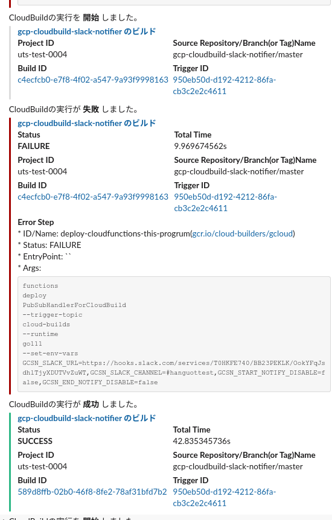
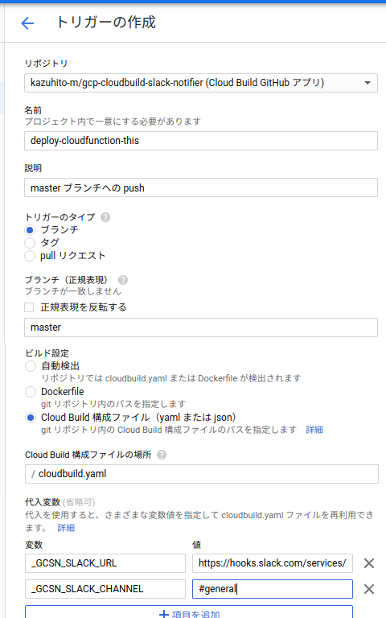

GCP Cloud Build Notifier for Slack
==================================

GCP にて Cloud Build が実行された際に Slack に通知する、 Cloud Functions 用プログラム。



## What's this ?

Cloud Buildの結果を通知するものは、現時点(2019/12)で公式では「Pub/Subの通知をCloud Fucntionsのプログラムで検知し、自力で行う」という手段が提案されているのみである。

https://cloud.google.com/cloud-build/docs/configure-third-party-notifications

このプログラムは、出来る限り「汎用的」かつ「詳細」に情報をSlackに通知するプログラムです。

### 出来ること・機能

- Pub/Subに通知されるCloud Buildの「開始」「終了」通知を検知してSlackに通知
- 終了通知時に「失敗」と判定された場合、「ErrorとなったであろうStep」の情報を付加
- 環境変数にて「開始」「終了」の通知の無効化


## Usage

### Cloud Functions登録時に指定できる環境変数

| 環境変数                      | 必須  | 説明                                             |
| ------------------------- | --- | ---------------------------------------------- |
| GCSN_SLACK_URL            | [x] | 通知するSlackのWebhookURL。                          |
| GCSN_SLACK_CHANNEL        | [ ] | 通知するSlackのチャンネル。`#` 付きで指定する。未指定時には `#general`。 |
| GCSN_START_NOTIFY_DISABLE | [ ] | 開始時通知を無効化する。True:無効。                           |
| GCSN_END_NOTIFY_DISABLE | [ ] | 終了時通知を無効化する。True:無効。                           |


### Requirement

- GCPにプロジェクトが作成済みであること
- GCPにユーザ(IAMアカウント)を持っていること
    - Cloud FunctionsにFunctionを登録できる権限があること
- ローカルから `gcloud` コマンドが発行できること
- Slackに「Incoming Webhook」が登録されていること
    - WebhookのURLが解っていること

### gcloudコマンド(のスクリプト)でCloud Functionsに登録する場合

前述の前提を満たした状態で、以下のコマンドをbashコンソールから実行します。

```bash
export GCSN_SLACK_URL=https://hooks.slack.com/services/xxxx...  # SlackのWebhookURL
export GCSN_SLACK_CHANNEL='#general'  # Slackのチャンネル(#から記述)

./deploy.sh
```
実行後、Cloud Functionsに `PubSubHandlerForCloudBuild` というFunctionが作成されれば成功です。

### Cloud Buildトリガーで自動的にCloud Functionsに登録する場合

CloudBuildのサービスアカウント( [数値]@cloudservices.gserviceaccount.com )に、

- サービス アカウント ユーザー(roles/iam.serviceAccountUser)

のロールが在ることを確認します。

Cloud Buildの管理画面からTriggerを登録します。



- 本家(このGitHubのリポジトリ)の更新に巻き込まれたくない場合は、Forkするか、「GCP Cloud Source Repositories」にソースをコピーするなどして下さい

初回ビルド起動で、Cloud Functionsに `PubSubHandlerForCloudBuild` というFunctionが作成されれば成功です。